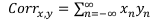
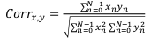

# Лаборатороная №3

1. Напишите на языке C/C++ функцию вычисления корреляции и
нормализованной корреляции между массивами a, b и с:

```c++
    int a[] = {1,3,5,-1,-4,-5,1,4};
    int b[] = {2,4,7,0,-3,-4,2,5};
    int c[] = {-5,-1,3,-4,2,-6,4,-1};
```
<br>

- Функция для корреляции:

```c++
int correlation(int a[], int b[], int n){
    int sum=0;
    for(int i=0; i<n; i++){
        sum+=a[i]*b[i];
    }
    return sum;
}
```  

<br>         
Формула для расчёта корреляции:


  

<br>

- Функция для нормализованной корреляции:


```c++
double normCorr(int a[], int b[], int n){
    int corr = correlation(a,b,n);
    int sumA = 0, sumB=0;
    for(int i=0;i<n;i++){
        sumA+=a[i]*a[i];
        sumB+=b[i]*b[i];
    } 
    double result = corr/sqrt(sumA*sumB);
    return result;
}
```

<br>         
Формула для расчёта нормализованной корреляции:



<br>

2. Результаты:

```bash
Корреляция между a, b и c:
\ | a | b | c
a | - | 103 | 33
b | 103 | - | 28
c | 33 | 28 | -

Нормализованная корреляция между a, b и c:
\ | a | b | c
a | - | 0.957901 | 0.32752
b | 0.957901 | - | 0.242937
c | 0.32752 | 0.242937 | -
```

продолжение следует...